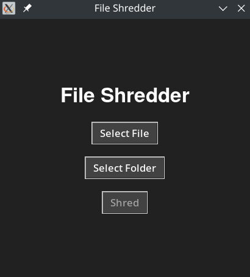

# FileShredder
## A tool for securely deleting files by overwriting them using a custom pattern


<!-- DESCRIPTION -->
## Description:

File shredding, also known as secure file deletion, offers several benefits in maintaining data privacy and security. Firstly, it ensures that sensitive or confidential information cannot be recovered once deleted, thus reducing the risk of data breaches or unauthorized access. By overwriting the deleted files with random data multiple times, file shredding makes it virtually impossible for data recovery software to reconstruct the original content.

<!-- FEATURES -->
## Features:

- Uses [Gutmann method](https://en.wikipedia.org/wiki/Gutmann_method)

- Minimalist GUI

- Data is irrecoverable after deleting

- Built in Python

<!-- INSTALLATION -->
## Installation:
```
git clone https://github.com/umutcamliyurt/FileShredder.git
cd FileShredder/
sudo apt-get update
sudo apt install python3 python3-tk
python3 file_shredder.py
```

<!-- SCREENSHOT -->
## Screenshot:



<!-- LICENSE -->
## License

Distributed under the MIT License. See `LICENSE` for more information.
